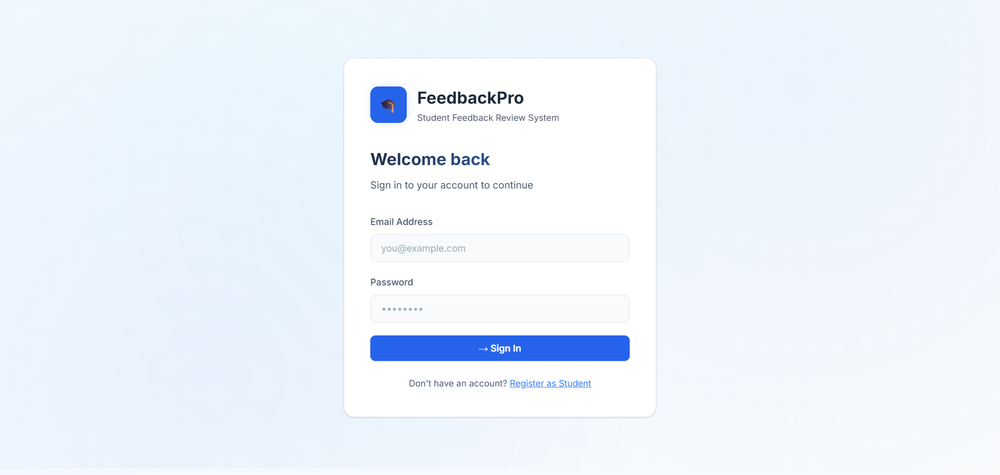

# 🎓 Student Feedback Review System

A full-stack MERN application for managing student feedback with role-based dashboards for Students, Faculty, and Admins.

---

## 🚀 Quick Start

### Prerequisites
- Node.js v18+
- MongoDB (local or Atlas)

---

### 1. Backend Setup

```bash
cd server
npm install
```

Create/edit `server/.env`:
```env
PORT=5000
MONGO_URI=mongodb://localhost:27017/feedback_system
JWT_SECRET=your_super_secret_jwt_key_change_this_in_production
JWT_EXPIRE=7d
```

Start the server:
```bash
npm run dev
```

Seed sample data (optional but recommended):
```bash
npm run seed
```

---

### 2. Frontend Setup

```bash
cd client
npm install
npm run dev
```

Frontend runs at: **http://localhost:5173**  
Backend runs at:  **http://localhost:5000**

---

## 🔐 Demo Credentials (after seeding)

| Role    | Email                  | Password    |
|---------|------------------------|-------------|
| Admin   | admin@feedback.com     | admin123    |
| Faculty | priya@feedback.com     | faculty123  |
| Faculty | rahul@feedback.com     | faculty123  |
| Student | aditya@feedback.com    | student123  |
| Student | sneha@feedback.com     | student123  |

---

## 📁 Project Structure

```
Assignmnet7/
├── server/
│   ├── models/
│   │   ├── User.js
│   │   ├── Subject.js
│   │   └── Feedback.js
│   ├── controllers/
│   │   ├── authController.js
│   │   ├── adminController.js
│   │   ├── studentController.js
│   │   └── facultyController.js
│   ├── routes/
│   │   ├── authRoutes.js
│   │   ├── adminRoutes.js
│   │   ├── studentRoutes.js
│   │   └── facultyRoutes.js
│   ├── middleware/
│   │   └── authMiddleware.js
│   ├── seedData.js
│   ├── server.js
│   └── .env
│
└── client/
    └── src/
        ├── components/
        │   ├── Sidebar.jsx
        │   └── PrivateRoute.jsx
        ├── context/
        │   └── AuthContext.jsx
        ├── pages/
        │   ├── Login.jsx
        │   ├── Register.jsx
        │   ├── Admin/
        │   │   ├── AdminDashboard.jsx
        │   │   ├── AdminStudents.jsx
        │   │   ├── AdminFaculty.jsx
        │   │   ├── AdminSubjects.jsx
        │   │   └── AdminFeedback.jsx
        │   ├── Student/
        │   │   └── StudentDashboard.jsx
        │   └── Faculty/
        │       └── FacultyDashboard.jsx
        ├── services/
        │   └── api.js
        ├── App.jsx
        ├── main.jsx
        └── index.css
```

---

## 📡 API Endpoints

### Auth
| Method | Endpoint             | Description         |
|--------|----------------------|---------------------|
| POST   | /api/auth/register   | Register (student)  |
| POST   | /api/auth/login      | Login all roles     |
| GET    | /api/auth/me         | Get current user    |

### Admin (requires admin JWT)
| Method | Endpoint                      | Description                  |
|--------|-------------------------------|------------------------------|
| GET    | /api/admin/stats              | Dashboard statistics          |
| GET    | /api/admin/users?role=student | List users by role            |
| POST   | /api/admin/users              | Create any user               |
| DELETE | /api/admin/users/:id          | Delete user                   |
| PATCH  | /api/admin/users/:id/toggle   | Toggle user active status     |
| GET    | /api/admin/subjects           | List all subjects             |
| POST   | /api/admin/subjects           | Create subject                |
| PUT    | /api/admin/subjects/:id       | Update/assign faculty         |
| DELETE | /api/admin/subjects/:id       | Delete subject + feedback     |
| GET    | /api/admin/feedback           | All feedback                  |
| DELETE | /api/admin/feedback/:id       | Soft-delete feedback          |

### Student (requires student JWT)
| Method | Endpoint                  | Description              |
|--------|---------------------------|--------------------------|
| GET    | /api/student/subjects     | Available subjects        |
| POST   | /api/student/feedback     | Submit feedback           |
| GET    | /api/student/feedback/mine| My feedback history       |

### Faculty (requires faculty JWT)
| Method | Endpoint                  | Description              |
|--------|---------------------------|--------------------------|
| GET    | /api/faculty/subjects     | My assigned subjects      |
| GET    | /api/faculty/feedback     | Feedback for my subjects  |
| GET    | /api/faculty/analytics    | Aggregated analytics      |
| GET    | /api/faculty/stats        | Quick summary stats       |

---

## 🛡️ Security Features
- **bcryptjs** password hashing (salt rounds: 12)
- **JWT** authentication with configurable expiry
- **Role-based** route protection (middleware)
- CORS restricted to frontend origin
- Passwords never returned in API responses

## 🎨 Tech Stack
- **Frontend**: React 19 + Vite, Chart.js, React Router v6, Axios, react-hot-toast
- **Backend**: Node.js, Express.js, Mongoose, bcryptjs, jsonwebtoken
- **Database**: MongoDB

---

## 🌐 Deployment

### MongoDB Atlas
Replace `MONGO_URI` in `.env` with your Atlas connection string.

### Backend (Render/Railway)
- Set all `.env` variables in the dashboard
- Build command: `npm install`
- Start command: `npm start`

### Frontend (Vercel/Netlify)
- `cd client && npm run build`
- Deploy the `dist/` folder
- Set `VITE_API_URL` env variable if needed




 


